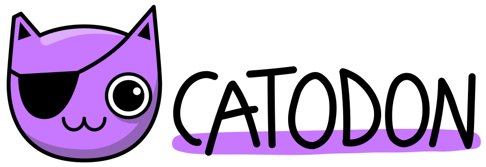

**🌎 **[Catodon](https://codeberg.org/catodon/catodon)** is an open source platform to build your federated community on!**

# About Catodon

- Welcome to the internet's next level: Federated communities! For years, online communication was mostly based on email and online communities like forums. Then the big social media came, and sucked in those independent communities. Now that we realize that this has given certain companies an inexcusable amount of power, and it's getting harder and harder to reach your contacts through all the ads. So, it's time to bring independent communities back - but on a new level: The ActivityPub protocol enables online communities to talk to each other, creating a vast network of networks - the Fediverse! This way a user is not restricted to the users of their community, but can interact with users on any other federated community! Keeping both the advantages of independent communities (privacy, human moderation, different rules so you can find a community that suits you) with the connection to more people that mainstream social media provides. Do you run an old forum, a facebook group, a discord server? Why not bring your community to the Fediverse, and have full control over your communication? The more federated communities we build, the bigger -and more useful for everyone- the whole Fediverse will become!
- Catodon is an amazing tool to build your federated community on. It is the result of the work of hundreds of open source contributors, as it is based on Firefish - which in turn was based on Misskey. This means it is a fully featured platform with emoji reactions, quotes, custom feeds, chat, forums, blog posts and many more! All using easy to understand terminology, with simple menus, making sure your users will feel at home in no time. Everyone on your server will be able to interact with users from other Catodon servers, as well as the millions of users on Mastodon, Pixelfed, Friendica, Peertube and the rest of the platforms that use the ActivityPub protocol. With Catodon you can practically have your own social network, with your own rules, but already with millions of users to follow and interact with!

## Major Changes from Upstream

- In Catodon, new users aren't greeted with a blank Home timeline. Local posts from your community server are also shown in your users' Home feed, so that when new users join they instantly have content to interact with. This gives a more welcoming onboarding experience, and promotes the sense of community. It also makes new users more noticeable. After they have built their follows list, users can choose to display only posts from accounts they follow in their Home timeline.
- Your server logo is always visible under the menu, making each server more unique. The PWA (App) is also displayed with your server logo by default.
- No donation popups.

# Getting Started

*TBD*

The installation guide is planned to be available with the first release. In the meantime, you can refer [INSTALL.md](INSTALL.md).

# Contributions

Thank you so much for your interest in helping Catodon. Please read our [code of conduct](CODE_OF_CONDUCT.md) before making any contributions to Catodon.

People from around the world, of all backgrounds, genders, and experience levels are welcome and respected equally.

Black lives matter. Trans rights are human rights. No nazi bullsh*t.
